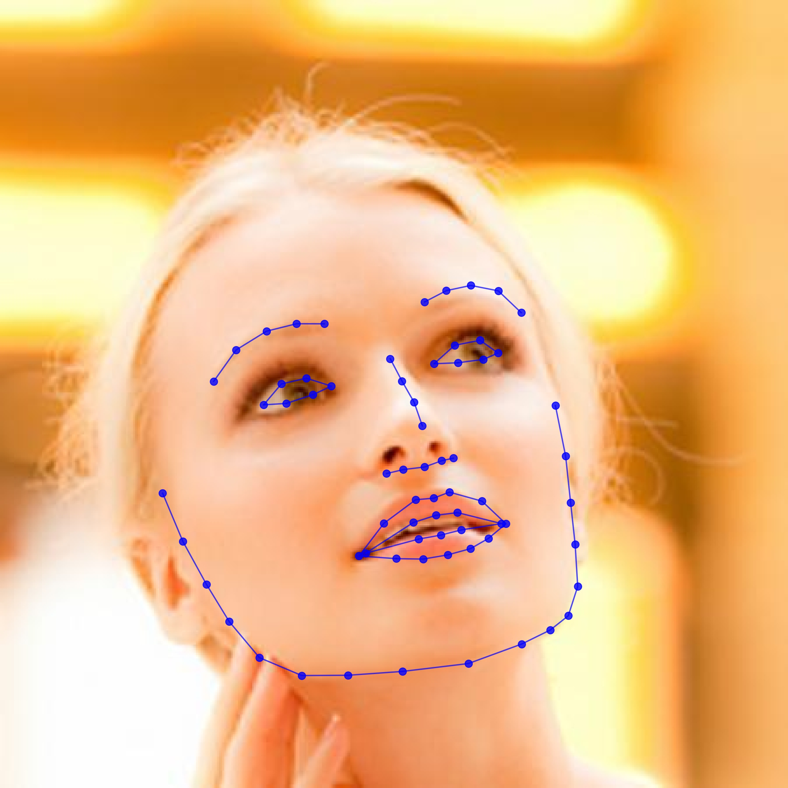

# Learning Collaborative Reinforcement Attention for 3D Face Reconstruction and Dense Alignmen
### Usage
1. Run the `main.py` with arbitrary image as input
    ```
    python3 main.py -f samples/test1.jpg
#### 1. Face Alignment
<p align="center">
  
</p>

#### 2. Face Reconstruction
<p align="center">
  
</p>  
